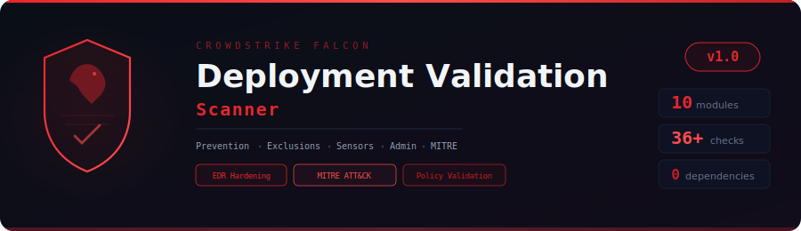

<p align="center">
  
</p>

<p align="center">
  <strong>Offline security posture assessment for CrowdStrike Falcon EDR deployments</strong><br/>
  <em>Find the policy gaps, dangerous exclusions, and configuration drift that attackers exploit</em>
</p>

<p align="center">
  
  
  
  
  
  
</p>

---

## Why This Exists

CrowdStrike Falcon is one of the most capable EDR platforms available — but **misconfiguration is the #1 cause of EDR failures in real-world incidents**. Security teams invest heavily in Falcon licensing, but gaps in policy tuning, exclusion management, and sensor health silently erode protection.

### Common Issues Found in Production Deployments

| Issue | Impact | How Common |
|-------|--------|------------|
| Prevention policies in **detect-only** mode | Threats detected but **not blocked** | Very common after initial rollout |
| Broad ML exclusions on `C:\Windows\Temp` | Malware drops to Temp and **executes undetected** | Extremely common |
| LOLBin process exclusions (PowerShell, cmd) | Attackers use living-off-the-land binaries **unmonitored** | Common in dev environments |
| Sensors in Reduced Functionality Mode (RFM) | **Near-zero detection** — sensor is effectively dead | Common on Linux after kernel updates |
| Sensor ML levels set to Cautious/Disabled | Zero-day and unknown malware **bypasses ML engine** | Common default configuration |
| Uninstall protection disabled | Local admin can **silently remove the sensor** | Often missed |
| Hosts with no prevention policy assigned | Sensor installed but **no protection active** | Configuration drift |
| Sensor Visibility exclusions on temp folders | **Complete telemetry blind spot** — worse than ML exclusions | Dangerous when misconfigured |

This scanner audits your Falcon configuration exports against CrowdStrike's recommended settings, industry best practices, and common attacker techniques to find these gaps **before attackers do**.

---

## How It Works

```
┌──────────────────────────────────────────────────────────────────┐
│            CrowdStrike Falcon Configuration Exports               │
│   FalconPy API  ·  Console JSON  ·  Falcon Data Replicator       │
└──────────────────────────────┬───────────────────────────────────┘
                               │
                    ┌──────────▼──────────┐
                    │     Data Loader      │
                    │  (modules/base.py)   │
                    └──────────┬──────────┘
                               │
       ┌───────────────────────┼───────────────────────┐
       │                       │                        │
┌──────▼───────┐    ┌─────────▼─────────┐    ┌────────▼────────┐
│   Policy      │    │   Exclusion       │    │   Platform      │
│  Validation   │    │   Audit           │    │  Security       │
│  4 modules    │    │   1 module        │    │  5 modules      │
│  Prevention   │    │   ML / IOA / SV   │    │  Sensors, Admin │
│  Updates      │    │   Paths, LOLBins  │    │  IOAs, FW,      │
│  Response     │    │   Scope, Count    │    │  MITRE ATT&CK   │
│  Device Ctrl  │    │                   │    │                 │
└──────┬───────┘    └─────────┬─────────┘    └────────┬────────┘
       │                       │                        │
       └───────────────────────┼───────────────────────┘
                               │
                    ┌──────────▼──────────┐
                    │   HTML Dashboard    │
                    │   Report            │
                    └─────────────────────┘
```

---

## Modules (10)

### Policy Validation (4 modules, 18 checks)

<details>
<summary>🛡️ <strong>Module 1: Prevention Policy Validation</strong> — 10 checks</summary>

| Check | ID | Severity | Description |
|-------|-----|----------|-------------|
| NGAV settings disabled | PREV-002 | HIGH | Cloud Anti-Malware, Sensor Anti-Malware, or Adware/PUP detection disabled |
| Behavioral prevention gaps | PREV-003 | HIGH | Suspicious Processes, Registry Ops, Scripts, Intel Threats, or Kernel Drivers not blocking |
| Exploit mitigations disabled | PREV-004 | MEDIUM | Force ASLR, DEP, Heap Spray, Null Page, or SEH protection off |
| ML detection levels too low | PREV-005 | HIGH | Cloud ML or Sensor ML set to Cautious/Disabled instead of Moderate/Aggressive |
| Detect-only mode | PREV-006 | HIGH | Settings detect threats but do NOT block — common post-deployment oversight |
| Unassigned policies | PREV-007 | MEDIUM | Prevention policies not assigned to any host group (no effect) |
| Hosts without prevention policy | PREV-008 | CRITICAL | Sensor installed but no prevention policy = completely unprotected |
| Ransomware prevention disabled | PREV-009 | CRITICAL | Ransomware protection in detect-only or disabled |
| Script monitoring off | PREV-010 | HIGH | Script-Based Execution Monitoring disabled — PowerShell, VBScript, macros unmonitored |
| No policies found | PREV-001 | CRITICAL | No prevention policy data exported |

**Key settings checked per policy:**

NGAV: `cloudAntiMalware`, `sensorAntiMalware`, `adwarePUP`, `cloudMLSlider`, `onSensorMLSlider`

Behavioral: `suspiciousProcesses`, `suspiciousRegistryOperations`, `suspiciousScriptsAndCommands`, `intelligenceSourcedThreats`, `suspiciousKernelDrivers`, `interpreterProtection`

Exploit Mitigation: `forceASLR`, `forceDEP`, `heapSprayPreallocation`, `nullPageAllocation`, `SEHOverwriteProtection`
</details>

<details>
<summary>🔄 <strong>Module 2: Sensor Update Policy</strong> — 4 checks</summary>

| Check | ID | Severity | Description |
|-------|-----|----------|-------------|
| Pinned sensor versions | UPD-002 | MEDIUM | Sensors pinned to specific version — miss new detection capabilities |
| Multiple sensor versions | UPD-003 | MEDIUM | >3 different sensor versions across fleet — inconsistent protection |
| Uninstall protection disabled | UPD-004 | HIGH | Local admins can silently remove the sensor without a maintenance token |
| No update policies | UPD-001 | MEDIUM | No sensor update policy data to validate |

**Recommended:** Use N-1 or N-2 auto-update. Never pin to a specific version unless required for change control. Always enable uninstall protection.
</details>

<details>
<summary>🔧 <strong>Module 3: Response Policy</strong> — 2 checks</summary>

| Check | ID | Severity | Description |
|-------|-----|----------|-------------|
| RTR disabled | RSP-001 | MEDIUM | Real-Time Response not enabled — cannot remotely investigate or remediate |
| Unrestricted custom RTR scripts | RSP-002 | MEDIUM | Any admin can run arbitrary scripts on endpoints |
</details>

<details>
<summary>🔌 <strong>Module 4: Device Control</strong> — 2 checks</summary>

| Check | ID | Severity | Description |
|-------|-----|----------|-------------|
| No USB policies configured | DEV-001 | MEDIUM | USB devices uncontrolled — data exfiltration risk |
| USB default action is ALLOW | DEV-002 | MEDIUM | All USB devices allowed by default |
</details>

---

### Exclusion Audit (1 module, 7 checks)

<details>
<summary>⚠️ <strong>Module 5: Exclusion Audit</strong> — 7 checks (MOST CRITICAL MODULE)</summary>

| Check | ID | Severity | Description |
|-------|-----|----------|-------------|
| Dangerous ML exclusion paths | EXC-001 | CRITICAL | ML exclusions on attacker-abused paths (Temp, AppData, ProgramData, drives) |
| Global-scope ML exclusions | EXC-002 | HIGH | ML exclusions applied to ALL hosts instead of specific groups |
| Excessive IOA exclusions | EXC-003 | HIGH | >20 IOA exclusions — each reduces behavioral detection coverage |
| SV exclusions on dangerous paths | EXC-004 | CRITICAL | Sensor Visibility exclusions = COMPLETE telemetry blind spot |
| Wildcard exclusions | EXC-005 | HIGH | Exclusions using `\*`, `/**`, or `**` patterns — overly broad |
| High total exclusion count | EXC-006 | MEDIUM | >50 total exclusions across ML/IOA/SV — indicates over-exclusion |
| LOLBin process exclusions | EXC-007 | CRITICAL | Exclusions for powershell.exe, cmd.exe, mshta.exe, certutil.exe, etc. |

**Dangerous paths flagged:**

`C:\Windows\Temp`, `C:\Temp`, `C:\Users\Public`, `C:\ProgramData`, `C:\Windows\System32`, `C:\Windows\SysWOW64`, `\AppData\Local\Temp`, `\AppData\Roaming`, `C:\`, `D:\`, `*\Downloads`, `*\Desktop`, `/tmp`, `/var/tmp`, `/dev/shm`, `/home`, `/opt`

**Dangerous executable extensions flagged:**

`*.exe`, `*.dll`, `*.ps1`, `*.bat`, `*.cmd`, `*.vbs`, `*.js`, `*.hta`, `*.scr`, `*.msi`, `*.wsf`, `*.py`, `*.sh`, `*.elf`

**LOLBin processes flagged:**

`powershell.exe`, `cmd.exe`, `wscript.exe`, `cscript.exe`, `mshta.exe`, `regsvr32.exe`, `rundll32.exe`, `certutil.exe`, `bitsadmin.exe`, `bash`, `python`, `perl`, `ruby`, `sh`

**Why this matters:** Attackers routinely drop payloads to Temp folders, use LOLBins for execution, and exploit broad exclusions. A single `C:\Windows\Temp\*` ML exclusion can negate Falcon's malware detection entirely in that path.
</details>

---

### Platform Security (5 modules, 11 checks)

<details>
<summary>💚 <strong>Module 6: Sensor Health & Coverage</strong> — 4 checks</summary>

| Check | ID | Severity | Description |
|-------|-----|----------|-------------|
| Sensors not in normal status | SENSOR-001 | HIGH | Offline/degraded sensors have no protection |
| Hosts in RFM | SENSOR-002 | CRITICAL | Reduced Functionality Mode = near-zero detection |
| Stale sensors (>30 days offline) | SENSOR-003 | MEDIUM | Hosts haven't reported in 30+ days |
| OS distribution | SENSOR-004 | LOW | Fleet composition for coverage analysis |

**RFM causes:** Linux kernel update without CrowdStrike support, sensor corruption, driver compatibility issues. RFM sensors should be treated as urgent — they provide almost no protection.
</details>

<details>
<summary>👤 <strong>Module 7: Admin & API Security</strong> — 4 checks</summary>

| Check | ID | Severity | Description |
|-------|-----|----------|-------------|
| Excessive Falcon Admin accounts | ADMIN-001 | MEDIUM | >5 users with Falcon Administrator role |
| Console users without MFA | ADMIN-002 | HIGH | Falcon console access without multi-factor authentication |
| API clients with broad scopes | ADMIN-003 | HIGH | OAuth2 API clients with write/admin/wildcard scopes |
| No custom RBAC roles | ADMIN-004 | LOW | Using only default roles — may not enforce least privilege |
</details>

<details>
<summary>🎯 <strong>Module 8: Custom IOA Rules</strong> — 2 checks</summary>

| Check | ID | Severity | Description |
|-------|-----|----------|-------------|
| No custom IOA rules configured | IOA-001 | MEDIUM | No environment-specific behavioral detection rules |
| Disabled custom IOA rules | IOA-002 | LOW | Custom rules created but not active |
</details>

<details>
<summary>🔥 <strong>Module 9: Firewall Policy</strong> — 1 check</summary>

| Check | ID | Severity | Description |
|-------|-----|----------|-------------|
| No Falcon Firewall policies | FW-001 | MEDIUM | Host-based firewall not managed by CrowdStrike |
</details>

<details>
<summary>🗺️ <strong>Module 10: MITRE ATT&CK Coverage</strong> — 1 check</summary>

| Check | ID | Severity | Description |
|-------|-----|----------|-------------|
| MITRE ATT&CK technique coverage | MITRE-001 | LOW | Top 10 techniques mapped against prevention policy settings |

**Top 10 Techniques Assessed:**

| Technique | ATT&CK ID | Falcon Setting Required |
|-----------|-----------|------------------------|
| Command and Scripting Interpreter | T1059 | `suspiciousScriptsAndCommands` |
| Scheduled Task/Job | T1053 | `suspiciousProcesses` |
| OS Credential Dumping | T1003 | `suspiciousProcesses` + ML |
| Remote Services | T1021 | Network monitoring / Identity |
| Process Injection | T1055 | `suspiciousProcesses` |
| Valid Accounts | T1078 | Identity Protection module |
| Data Encrypted for Impact | T1486 | `ransomware` prevention |
| System Information Discovery | T1082 | Behavioral IOAs |
| Windows Management Instrumentation | T1047 | `suspiciousScriptsAndCommands` |
| System Binary Proxy Execution | T1218 | `suspiciousProcesses` + no LOLBin exclusions |
</details>

---

## Quick Start

```bash
git clone https://github.com/Krishcalin/CrowdStrike-Falcon-Validation-Scanner.git
cd CrowdStrike-Falcon-Validation-Scanner

# Scan with sample data (includes deliberate misconfigurations)
python cs_scanner.py --data-dir ./sample_data --output report.html

# Scan specific modules
python cs_scanner.py --data-dir ./exports --modules prevention exclusions sensors

# Filter by severity
python cs_scanner.py --data-dir ./exports --severity HIGH

# Scan only exclusions (the most critical module)
python cs_scanner.py --data-dir ./exports --modules exclusions
```

---

## Exporting CrowdStrike Falcon Configurations

### Option A: FalconPy SDK (Recommended)

```python
from falconpy import (PreventionPolicy, SensorUpdatePolicy,
    Hosts, HostGroup, MLExclusions, IOAExclusions)
import json

# Initialize (use env vars for credentials)
pp = PreventionPolicy(client_id=CLIENT_ID, client_secret=CLIENT_SECRET)
su = SensorUpdatePolicy(client_id=CLIENT_ID, client_secret=CLIENT_SECRET)
hosts = Hosts(client_id=CLIENT_ID, client_secret=CLIENT_SECRET)
ml = MLExclusions(client_id=CLIENT_ID, client_secret=CLIENT_SECRET)

# Export prevention policies
resp = pp.query_combined_policies()
json.dump(resp["body"], open("prevention_policies.json", "w"), indent=2)

# Export sensor update policies
resp = su.query_combined_policies()
json.dump(resp["body"], open("sensor_update_policies.json", "w"), indent=2)

# Export hosts (sensors)
resp = hosts.query_devices_by_filter_scroll(limit=5000)
device_ids = resp["body"]["resources"]
details = hosts.get_device_details(ids=device_ids)
json.dump(details["body"], open("hosts.json", "w"), indent=2)

# Export ML exclusions
resp = ml.query_exclusions()
exc_ids = resp["body"]["resources"]
details = ml.get_exclusions(ids=exc_ids)
json.dump(details["body"], open("ml_exclusions.json", "w"), indent=2)

# Repeat for: IOA exclusions, SV exclusions, host groups,
# admin users, API clients, response policies, device control
```

### Option B: Falcon Console (Manual)

Export JSON from each configuration page in the Falcon console. Save each export to a directory:

```
exports/
├── prevention_policies.json
├── sensor_update_policies.json
├── response_policies.json
├── device_control_policies.json
├── ml_exclusions.json
├── ioa_exclusions.json
├── sv_exclusions.json
├── hosts.json
├── host_groups.json
├── admin_users.json
├── admin_roles.json
├── api_clients.json
└── custom_ioas.json
```

### Option C: Falcon Data Replicator (FDR)

For large deployments, use FDR to stream configuration data to S3/SIEM, then export to JSON.

---

## Available Modules

```
Policy Validation:
  prevention   — Prevention Policy (NGAV, ML, behavioral, exploit, ransomware)
  updates      — Sensor Update Policy (versions, uninstall protection)
  response     — Response Policy (RTR, custom scripts)
  device       — Device Control (USB policies)

Exclusion Audit:
  exclusions   — ML, IOA, and Sensor Visibility exclusions (dangerous paths,
                 LOLBins, wildcards, scope, count)

Platform Security:
  sensors      — Sensor Health (offline, RFM, stale, OS distribution)
  admin        — Admin & API Security (MFA, RBAC, API scopes)
  ioas         — Custom IOA Rules (exist, enabled)
  firewall     — Falcon Firewall Policy

Compliance:
  mitre        — MITRE ATT&CK technique coverage assessment

  all          — Run all 10 modules (default)
```

---

## Project Structure

```
CrowdStrike-Falcon-Validation-Scanner/
├── cs_scanner.py                      # Main entry point
├── modules/
│   ├── base.py                        # Data loader & base auditor
│   ├── policy_validation.py           # Prevention, Updates, Response, Device Control
│   ├── advanced_validation.py         # Exclusions, Sensors, Admin, IOAs, FW, MITRE
│   └── report_generator.py            # Interactive HTML dashboard report
├── sample_data/                       # 13 demo CrowdStrike config exports
│   ├── prevention_policies.json       # 3 policies with deliberate weaknesses
│   ├── sensor_update_policies.json    # Auto-update + pinned legacy
│   ├── response_policies.json         # RTR with unrestricted scripts
│   ├── device_control_policies.json   # USB default ALLOW
│   ├── ml_exclusions.json             # 7 dangerous ML exclusions
│   ├── ioa_exclusions.json            # 25 IOA exclusions (excessive)
│   ├── sv_exclusions.json             # 2 dangerous SV exclusions
│   ├── hosts.json                     # 8 hosts (RFM, stale, unprotected)
│   ├── admin_users.json               # 6 admins (MFA gaps)
│   ├── admin_roles.json               # Default roles only
│   ├── api_clients.json               # Wildcard API scope
│   ├── host_groups.json               # 4 host groups
│   └── sample_report.html             # Pre-generated HTML report
├── docs/
│   └── banner.svg                     # Project banner
├── .gitignore
├── LICENSE
├── CONTRIBUTING.md
└── README.md
```

---

## CrowdStrike Recommended vs. Common Misconfigurations

| Setting | Recommended | Common Misconfig | Risk |
|---------|-------------|------------------|------|
| Cloud Anti-Malware | **Block (Moderate+)** | Detect-only | Malware detected but runs |
| Sensor ML | **Moderate or Aggressive** | Cautious or Disabled | Zero-days bypass ML |
| Suspicious Scripts | **Block** | Detect-only | PowerShell attacks succeed |
| Ransomware | **Block (Aggressive)** | Detect-only | Encryption completes |
| Uninstall Protection | **Enabled** | Disabled | Attacker removes sensor |
| ML Exclusions | **Specific paths only** | Temp folders, drives | Malware hides in exclusions |
| SV Exclusions | **Almost never needed** | Performance workaround | Total telemetry blind spot |

---

## Validation Workflow

```
1. Export      →  Use FalconPy or console to export configs
2. Scan        →  python cs_scanner.py --data-dir ./exports
3. Prioritize  →  Fix CRITICAL findings first (exclusions, RFM, no-policy hosts)
4. Remediate   →  Update policies, remove dangerous exclusions
5. Re-scan     →  Validate fixes — compare finding counts
6. Schedule    →  Run monthly to catch configuration drift
```

---

## Complementary Tools

This scanner validates **Falcon configuration**. For validating **detection efficacy** against your deployment, use these complementary tools:

| Tool | Purpose | URL |
|------|---------|-----|
| **Atomic Red Team** | Execute individual MITRE ATT&CK technique tests | github.com/redcanaryco/atomic-red-team |
| **MITRE Caldera** | Automated adversary emulation platform | github.com/mitre/caldera |
| **Falcon Validation Dashboard** | CrowdStrike's built-in detection test | Falcon Console |
| **CrowdStrike FalconPy** | Python SDK for Falcon API automation | falconpy.io |

---

## References

### CrowdStrike Documentation
- [CrowdStrike — Prevention Policy Settings](https://falcon.crowdstrike.com/documentation/22/prevention-policy)
- [CrowdStrike — Recommended Prevention Defaults](https://falcon.crowdstrike.com/documentation/22/prevention-policy#recommended-defaults)
- [CrowdStrike — Exclusion Best Practices](https://falcon.crowdstrike.com/documentation/40/exclusions)
- [CrowdStrike — Sensor Update Policies](https://falcon.crowdstrike.com/documentation/22/sensor-update-policy)
- [CrowdStrike — FalconPy SDK](https://www.falconpy.io/)
- [CrowdStrike — Falcon Data Replicator (FDR)](https://falcon.crowdstrike.com/documentation/9/falcon-data-replicator)

### Industry Guides
- [CrowdStrike Falcon IT Admin Guide (2026 Edition)](https://cyberphilearn.com/crowdstrike-falcon-it-admin-guide-2026/)
- [CrowdStrike Deployment to Maximum Protection](https://medium.com/fmisec/crowdstrike-falcon-series-deployment-to-maximum-protection-5ba791d33270)
- [Security Control Validation for CrowdStrike](https://ondefend.com/crowdstrike-security-control-validation/)
- [CrowdStrike Falcon Exposure Management — Misconfiguration Assessment](https://www.crowdstrike.com/en-us/platform/exposure-management/security-configuration-assessment/)

### MITRE ATT&CK
- [MITRE ATT&CK — Enterprise Matrix](https://attack.mitre.org/matrices/enterprise/)
- [MITRE ATT&CK — Software (CrowdStrike Falcon)](https://attack.mitre.org/software/)
- [Atomic Red Team — Test Library](https://github.com/redcanaryco/atomic-red-team)

### LOLBAS / Living Off The Land
- [LOLBAS Project](https://lolbas-project.github.io/)
- [GTFOBins](https://gtfobins.github.io/)

---

## Disclaimer

This tool is for **authorized security assessments of your own CrowdStrike Falcon deployment only**. It performs offline analysis of JSON configuration exports and does not connect to the Falcon API or any live environment. Always ensure you have proper authorization before exporting and analyzing EDR configurations.

---

## License

MIT License — see [LICENSE](LICENSE).
